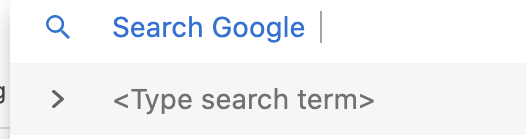

# chrome 添加 open search

很多站点都有按 tab 直接搜索，例如 google.com v.qq.com bilibili.com




## 添加方法

增加一个 header，包含一个 xml 即可

header：

```markup
<head>
    <link rel="search" type="application/opensearchdescription+xml" title="site name" href="/opensearch.xml" />
</head>
```

此 XML 型如：

```markup
<OpenSearchDescription xmlns="http://a9.com/-/spec/opensearch/1.1/">
    <ShortName>Example.com</ShortName>
    <LongName>Example.com Search</LongName>
    <Description>Search through Example.com</Description>
    <Query role="example" searchTerms="example search"/>
    <InputEncoding>UTF-8</InputEncoding>
    <OutputEncoding>UTF-8</OutputEncoding>
    <AdultContent>false</AdultContent>
    <Language>en-us</Language>
    <SyndicationRight>open</SyndicationRight>
    <Developer>Example.com</Developer>
    <Tags>tag1,tag2</Tags>
    <Image height="16" width="16" type="image/vnd.microsoft.icon">http://example.com/favicon.ico</Image>
    <Url type="text/html" template="http://example.com/search.html?q={searchTerms}"/>
    <Url type="application/x-suggestions+json" template="http://example.com/suggestions.html?query={searchTerms}"/>
</OpenSearchDescription>
```

## 以百度为例：

header 里添加

```markup
<link rel="search" type="application/opensearchdescription+xml" href="/content-search.xml" title="百度搜索"/>
```

文件是

```markup
<OpenSearchDescription xmlns="http://a9.com/-/spec/opensearch/1.1/">
    <ShortName>百度搜索</ShortName>
    <Url type="text/html" template="https://www.baidu.com/s?wd={searchTerms}"/>
</OpenSearchDescription>
```

